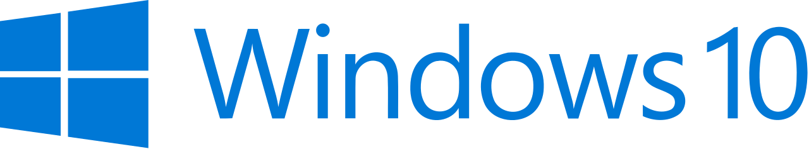
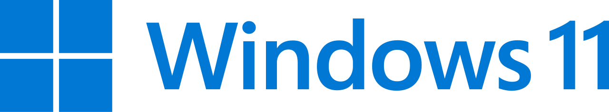

# Hi there👋
I'm a Japanese student who loves programming and learning new technologies.

---

## 🚀 My current project

* Currently, I am mainly working on web game development using **Javascript**.
* Goal: **Strengthening C++ skills and UI/UX skills**

## 🛠️ Skill stacks
**Main stack:** Frontend Web Development  

> 

> 

> 

---
