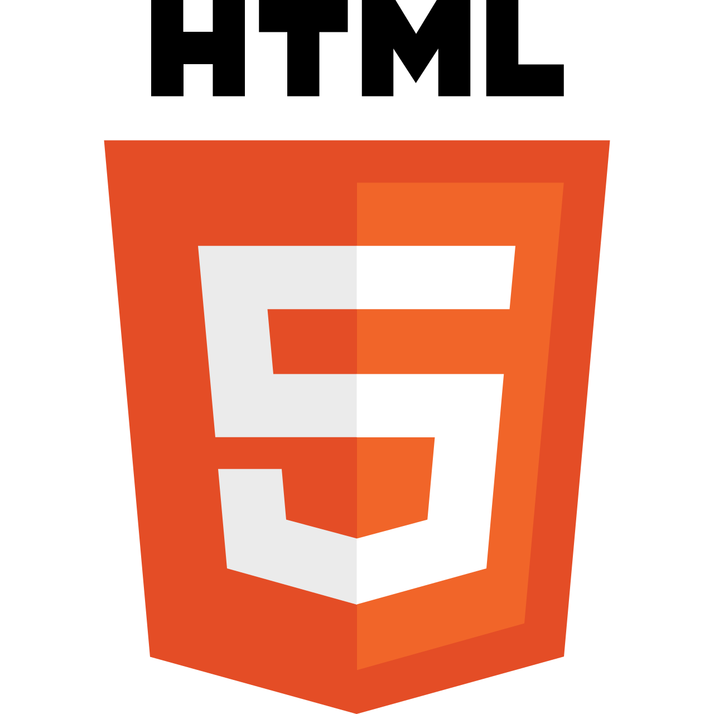
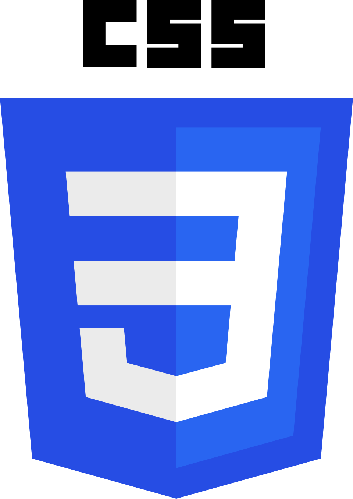
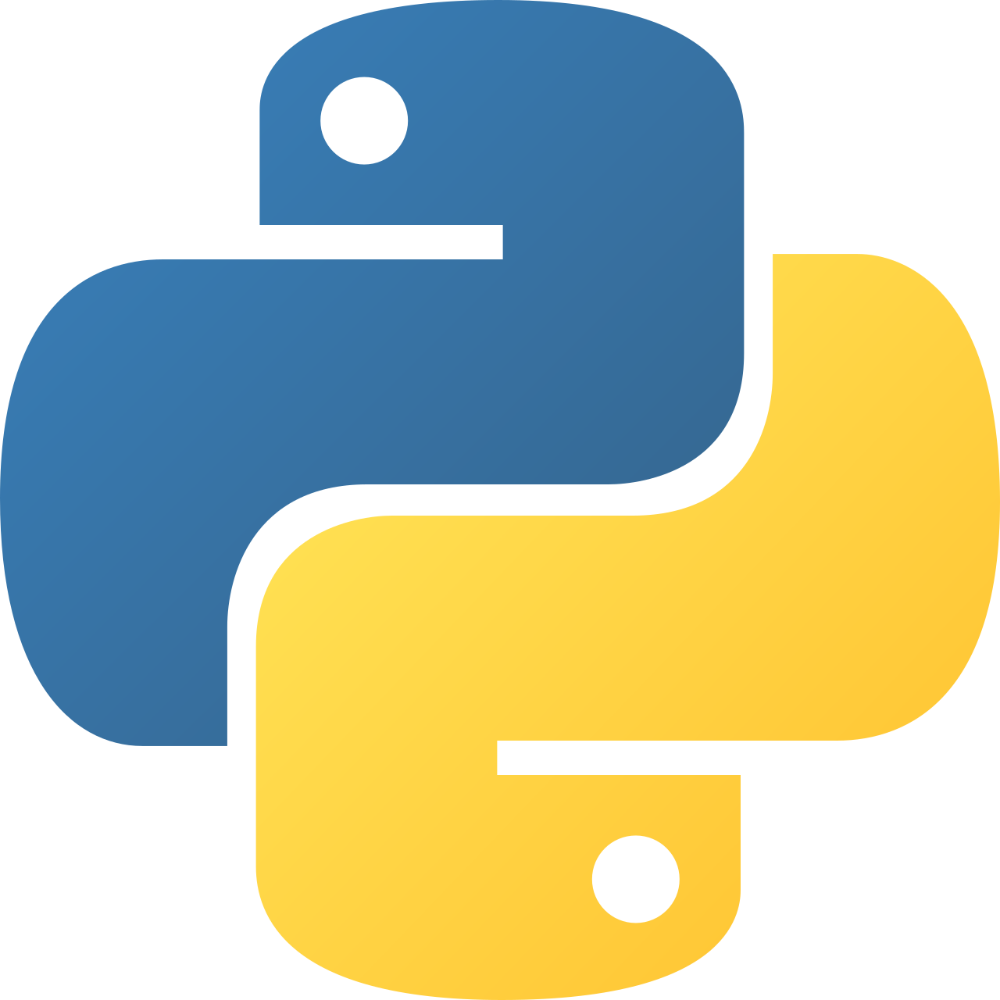
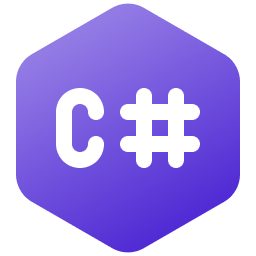
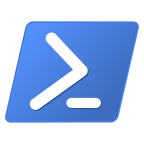
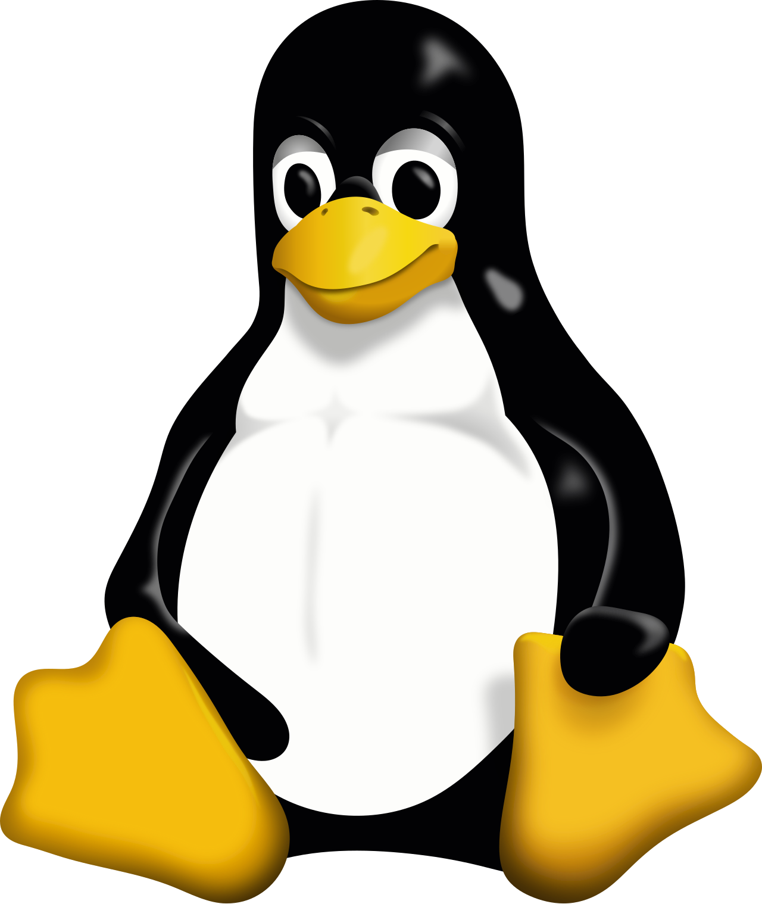
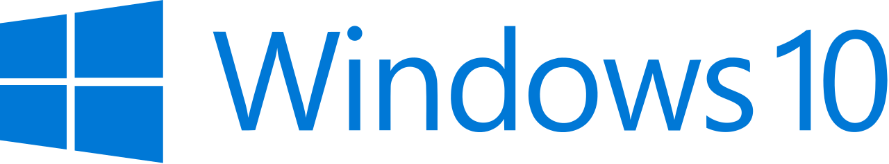
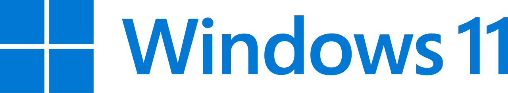

# Hi there👋
I'm a Japanese student who loves programming and learning new technologies. 
正直、英語はあまり得意ではないです…

## status

---
## 🤔 Just a thought to myself...
### July 18
As for my activities, I make it a rule to take Sundays and Mondays off.

### July 1
The lifespan of a technology is finite, yet it will likely continue to live on in altered forms. 
It is by no means a waste of effort.

### June 23
Things are getting busy. 
If programming were to become a special skill rather than just a hobby, what would I have done...? (I'm troubled)

> Only the most recent 3 days are posted.
## 🚀 My current project

* Currently, I am mainly working on web game development using **Javascript**.
* Goal: **Strengthening C++ skills and UI/UX skills**

## 🛠️ Skill stacks
### Code
**Main stack:** Frontend Web Development

> 

> 

> 

### Language
**mother tongue:** 日本語 
**`🔥` Icon:** Topics with recent active learning
> **Fluent:** `日本語`

> **Conversational:** `English`

> **Basic/Learning:** `Русский` `🔥Deutsch` `한국어` `简体中文` `🔥български` `Latviešu` `عربي`

---
